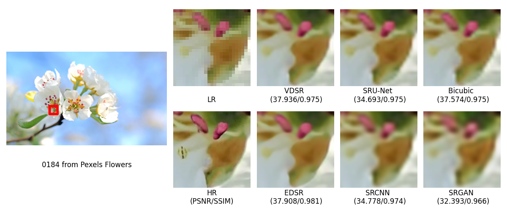
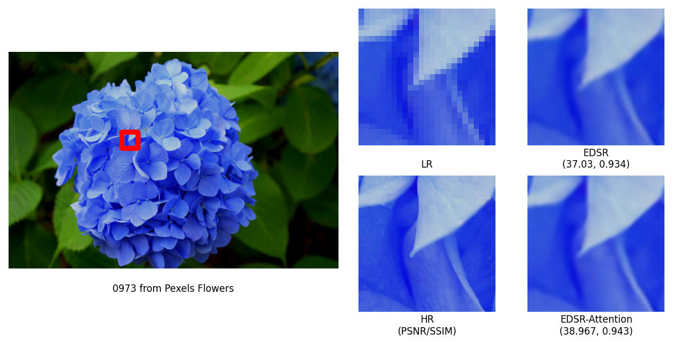

# Computer Vision Project: Single Image Super-resolution with Flower Images
# DSAI K65 - HUST

---
## Overview

We implement different algorithms and models for Single Image Super-resolution with Flower Images on a new novel [Pexels Flowers](https://www.kaggle.com/datasets/alas123dc/pexels-flowers-dataset-official) dataset.


<span class="img_container center" style="display: block;">
    
    <span class="img_caption" style="display: block; text-align: center;">Super-resolution results of "0184" test image (Pexels Flowers) with scale factor x4</span>
</span>

</br>
</br>


<span class="img_container center" style="display: block;">
    
    <span class="img_caption" style="display: block; text-align: center;">EDSR vs. EDSR attention with scale factor x4</span>
</span>

---

## Environment Setup

We use [miniconda](https://docs.conda.io/en/latest/miniconda.html) to install Python environment 

```
conda env create -f environment.yml
conda activate cv-env
```

**Note: If you use Google Colab or Kaggle, everything is already setup.*


## For Dataset Preparation and Training Code, the following Google Colab provides instruction on how to run the code.
```
https://colab.research.google.com/drive/1FUUh2Sav1IhfKmKPvRKROXAq_9bBBp6A?usp=sharing
```

## Team Members

| Member ID | Full Name       | Student ID    |  Github|
| :--:|    :---:              |   :---:       | :---:|
| 1   | Nguyen Quang Duc      | 20204876      |https://github.com/qducnguyen|
| 2   | Le Hong Duc           | 20204874      |https://github.com/duclh19 |
| 3   | Tran Le Phuong Thao   | 20200604      |https://github.com/TranafLee |
| 4   | La Dai Lam            | 20204918      |https://github.com/ladailam382 |
| 5   | Luu Trong Nghia       | 20204888      |https://github.com/nghialt0205 |

---
## Temporary Deployment Website

```
https://qducnguyen.github.io/cvdemo/
```

---


## Misc


- Source code for SISR: https://github.com/duclh19/SISR-sparse-representation

- Source code for Diffusion Model: https://github.com/TranafLee/SR3

- Source code for Crawling Data from Pexels: https://drive.google.com/drive/folders/1xLSdbiMBpqyv80IRCwhQX-OvEseCi2HB?usp=sharing

- Source code for Deployment on Google Colab: https://colab.research.google.com/drive/1FiY1Xx_AgDFPgd9YSeE1ACy4vI0zEbOd?usp=sharing

- Github Deployment branch: https://github.com/qducnguyen/cv-project-20222/tree/deployment


## Todo

- [x] RUSH_CV framework
- [x] Dataset Class
- [x] Read me download dataset, setting the dataset
- [x] Model Class
- [x] Debug mode
- [x] Training, Inference, Evaluation
- [x] Colab notebook illustration
- [x] Deployment Link

---

**Note: All the code need to run in this directory.* 

*All the code should be run on one of three platforms Linux OS, Google Colab, and Kaggle to work properly.*

*For any information, please contact me at ducnq.204876@sis.hust.edu.vn*
